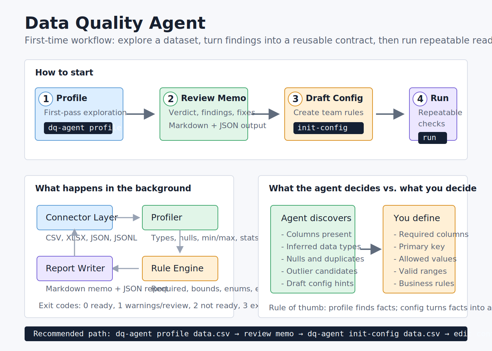

# Data Quality Agent

Python CLI for profiling local datasets and generating data-readiness reports.

MVP v1 supports CSV, XLSX, JSON, and JSONL files. It profiles the dataset, flags common quality issues, evaluates optional validation rules, and writes both a Markdown memo for humans and a JSON report for automation.



## Install

From this folder:

```bash
python -m pip install -e .
```

If `python` is not on PATH in the Codex desktop environment, use the bundled Python executable:

```powershell
& "C:\Users\annag\.cache\codex-runtimes\codex-primary-runtime\dependencies\python\python.exe" -m pip install -e .
```

## Quick Profile

```bash
dq-agent profile data/customers.csv
dq-agent profile data/customers.xlsx --sheet Customers
dq-agent profile data/events.jsonl --format jsonl
```

By default, quick profile mode writes reports to a `dq-reports/` folder next to the input file.

You can also choose explicit output paths:

```bash
dq-agent profile data/customers.csv --out reports/customers-readiness.md --json-out reports/customers-profile.json
```

## Universal Team Workflow

Use this loop when a dataset type will be reused by multiple teams:

1. Run `profile` for first-pass exploration.
2. Review the Markdown memo.
3. Draft a reusable config from the dataset.
4. Edit the config to reflect the business contract.
5. Use `run` for repeatable checks.

```bash
dq-agent profile data/customers.csv
dq-agent init-config data/customers.csv --dataset-name customers --primary-key customer_id --out configs/customers-dq.yml
dq-agent run configs/customers-dq.yml
```

`init-config` discovers the current columns and drafts a starting config. It does not magically know your business rules. Review the generated `required_columns`, `non_null`, `allowed_values`, bounds, and expressions before using it as a team contract.

## Config-Driven Run

```bash
dq-agent run dq-config.yml
```

Example config:

```yaml
input:
  path: data/customers.csv
  format: csv

dataset:
  name: customers
  primary_key: customer_id

rules:
  required_columns:
    - customer_id
    - email
    - created_at

  non_null:
    - customer_id
    - email

  allowed_values:
    status:
      - active
      - paused
      - cancelled

  bounds:
    revenue:
      min: 0

  expressions:
    - name: valid_date_order
      expression: "end_date >= start_date"
      severity: error

output:
  markdown: reports/customers-readiness.md
  json: reports/customers-profile.json
```

## Rules

MVP v1 supports:

- required columns
- non-null columns
- allowed values
- numeric bounds
- expected schema checks
- lightweight expressions

Expression rules support simple comparisons and boolean operators, such as:

```yaml
expressions:
  - name: valid_date_order
    expression: "end_date >= start_date"
    severity: error
```

Expressions are intentionally constrained. They do not execute arbitrary Python.

## Exit Codes

- `0`: run completed and no blocking issues were found
- `1`: run completed with warnings or review-needed findings
- `2`: run completed with error-severity findings
- `3`: execution failure, such as invalid config or unreadable input

## Limitations

MVP v1 does not support database connections, historical drift detection, Python plugin checks, cloud storage, scheduling, PII classification, automatic repair, or multi-sheet Excel profiling in one run.
